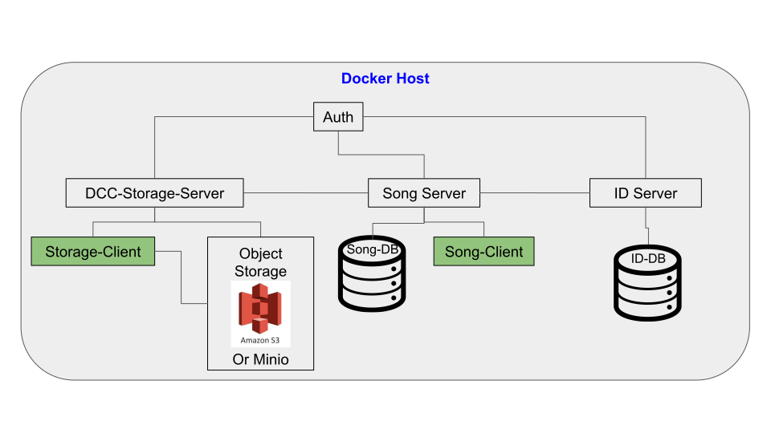

# Docker for Song Demo

## Quick Start
### 1. Prerequisites
#### Mandatory
* Docker version17.09.0-ce or higher
* Linux docker host machine (cannot run on `Docker for Mac` or `Docker for Windows`)
* Docker-compose version 1.16.1 and up
* Ports 8080 to 8089 on localhost are unused

#### Optional
* `jq` for json formatting and grepping (install via `apt install jq`)


### 2. Build and run docker
From this directory, run:

```
docker-compose build
docker-compose up
```

**Note:** An internet connection is only needed for the `docker-compose build` command. No external services are required for the `docker-compose up` command.

### 3. Example
#### Stage 1: SONG Upload

1. Check the song server is running
    
    ```bash
    ./data/client/bin/sing status -p
    ```

2. Upload the example VariantCall payload. This contains the metadata

    ```bash
    ./data/client/bin/sing upload -f  ./example/exampleVariantCall.json
    ```

3. Check the status of the upload, using the uploadId. Ensure the response has the state `VALIDATED`
    ```bash
    ./data/client/bin/sing status -u <uploadId>
    ```

4. Record or remember the uploadId from the response for the next phase

#### Stage 2: Song Saving and Manifest Generation
1. Save or commit the finalized metadata. The response will contain the analysisId
    ```bash
    ./data/client/bin/sing save -u <uploadId>
    ```

2. Search for the saved analysis, and observe the field `analysisState` is set to `UNPUBLISHED`
    ```bash
    ./data/client/bin/sing search -a <analysisId>
    ```

3. Optionally, if you have `jq` installed, you can pipe the output of the search, and filter out the `analysisType` field
    ```bash
    ./data/client/bin/sing search -a <analysisId>    |  jq ‘.analysisState’
    ```

4. Generate a manifest for the `icgc-storage-client` in [Stage 3](#stage-3-icgc-storage-upload)
    ```bash
    sudo ./data/client/bin/sing manifest -a <analysisId> -f manifest.txt
    ```

#### Stage 3: ICGC-Storage Upload 
Upload the manifest file to `icgc-dcc-storage` server using the [icgc-storage-client](http://docs.icgc.org/software/binaries/#storage-client). This will upload the files specified in the [exampleVariantCall.json](https://github.com/overture-stack/SONG/blob/develop/docker/example/exampleVariantCall.json) payload, which are located in the `./example` directory
```bash
./data/storage-client/bin/icgc-storage-client upload --manifest manifest.txt
```

#### Stage 4: SONG Publish

1. Using the same analysisId as before, publish it. Essentially, this is the handshake between the metadata stored in the SONG server (via the analysisIds) and the files stored in the icgc-storage-server (the files described by the analysisId)
    ```bash
    ./data/client/bin/sing publish -a <analysisId>
    ```

2. Search the analysisId, pipe it to jq and filter for `analysisState`, and observe the analysis has finally been **published** \!\!\!
    ```bash
    ./data/client/bin/sing search -a <analysisId>    |  jq ‘.analysisState’
    ```


---

---

## Additional Info

### Configuration
* All contained within the docker-compose.yml
* If a port is occupied on the localhost, it can be reconfigured by changing the value of the environment variable defining it
    * I.e SERVER_PORT, PGPORT, ID_PORT ... etc

### Service Architecture
* `storage-client` and `song-client` are command line tools and used locally. They are used to communicate with the `storage-server` and `song-server`, respectively



### Song for Docker Features
* Turn-key bring up of song, dcc-storage and auth environment
  
  
* Completely configurable via docker-compose environment variables (i.e change ports, jmx ports, hosts, credentials, and other important data fields). Values are injected into configurations using a custom python script
  
  
* Data from databases (song-db and id-db) and auth service are saved in volumes.
  
  
* Logs from song-server, dcc-storage-server and id-server are mounted to the docker host for easy viewing via the `./logs` directory
  
  
* Storage and song clients are automatically downloaded, configured and mounted to the docker host via the `./data` directory

* Minio (s3 object storage) data is also mounted via the `./data` directory. Files can be uploaded by simply copying into `./data/minio`


* Uses base-ubuntu and base-db images to minimize pulling and building of docker images, and maximize reuse


* If decide to go to production, the databases from the volumes can be easily dumped, and the data from minio can be uploaded directly


* **Bonus:** can manage Minio and OAuth using their UIs\!

### Bonus
1. Minio UI
    * Url: [http://localhost:8085](http://localhost:8085)
    * AccessKey: `minio`
    * SecretKey: `minio123`

2. OAuth2 UI
    * Adapted from the wonderful [dandric/simpleauth](https://github.com/andricDu/SimpleAuth) docker container
    * Url: [http://localhost:8084/admin](http://localhost:8084/admin)
    * Username: `john.doe`
    * Password: `songpassword`

### Issues
If you encounter any issues, please report them [here](https://github.com/overture-stack/SONG/issues)

### Disclaimer
Docker for Song is meant to **demonstrate** the configuration and usage of [SONG](https://github.com/overture-stack/SONG), and is **NOT INTENDED FOR PRODUCTION**. If you decide to ignore this warning and use this in any public or production environment, please remember to change the passwords, accessKeys, and secretKeys. 

### License

Copyright (c) 2018 The Ontario Institute for Cancer Research. All rights
reserved.

This program and the accompanying materials are made available under the
terms of the GNU Public License v3.0. You should have received a copy of
the GNU General Public License along with
this program. If not, see <http://www.gnu.org/licenses/>.

THIS SOFTWARE IS PROVIDED BY THE COPYRIGHT HOLDERS AND CONTRIBUTORS "AS IS"
AND ANY EXPRESS OR IMPLIED WARRANTIES, INCLUDING, BUT NOT LIMITED TO, THE
IMPLIED WARRANTIES OF MERCHANTABILITY AND FITNESS FOR A PARTICULAR PURPOSE
ARE DISCLAIMED. IN NO EVENT SHALL THE COPYRIGHT HOLDER OR CONTRIBUTORS BE
LIABLE FOR ANY DIRECT, INDIRECT, INCIDENTAL, SPECIAL, EXEMPLARY, OR
CONSEQUENTIAL DAMAGES (INCLUDING,BUT NOT LIMITED TO, PROCUREMENT OF
SUBSTITUTE GOODS OR SERVICES; LOSS OF USE, DATA,OR PROFITS; OR BUSINESS
INTERRUPTION) HOWEVER CAUSED AND ON ANY THEORY OF LIABILITY, WHETHER
IN CONTRACT, STRICT LIABILITY, OR TORT (INCLUDING NEGLIGENCE OR OTHERWISE)
ARISING IN ANY WAY OUT OF THE USE OF THIS SOFTWARE, EVEN IF ADVISED OF THE
POSSIBILITY OF SUCH DAMAGE.
