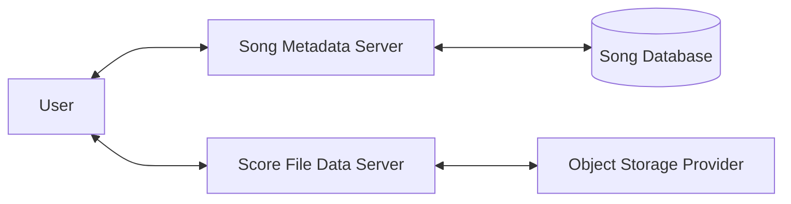

# Song

Song functions as a file catalog system, tracking files and managing their metadata. To manage file transfers to and from object storage Song interacts with its required companion application, [Score](https://github.com/overture-stack/score).

## Key Features

- **Admin Defined Schemas:** Customly define input fields with definable rules, logic and syntax
- **Metadata Validations:**  on submission with clear and concise error handling.
- **Automated Identifiers:** Song generates automated identifiers (Analysis IDs) linking metadata with object data handled by Score
- **OAuth2 Security:** ACL security using OAuth2 and scopes based on study codes for enhanced data protection.

## Advanced Features

- **Flexible Metadata Fields:** Optional schema-less JSON info fields for user-specific metadata, allowing customization.
- **Song Mirroring Support:** Export payloads for SONG mirroring, facilitating data synchronization.
- **Interactive API Documentation:** Built-in Swagger UI for easy API interaction and exploration.

## System Architecture
[Describe the high-level architecture of the system, you may choose to summarize each component with more details stored in a seperate markdown file within the `/docs/overview/` folder]



## Repository Structure

```
.
├── /song-client
├── /song-core
├── /song-go-client
└── /song-servers
```

#### song-clients

[Explaination]

#### song-core

[Explaination]

#### song-go-client

[Explaination]

#### song-server

[Explaination]

## Integrations

As part of the larger Overture.bio software suite, Song is typically used with additional integrations, including:

- **Event Streaming:** Built-in support for [Apache Kafka](https://kafka.apache.org/) event streaming allows other services to respond when analyses are registered and published.

- **Maestro Indexing:** Song is built to natively integrate with [Maestro](https://github.com/overture-stack/maestro), which will easily index data into a configurable Elasticsearch index, to be used for convenient searching of data.
