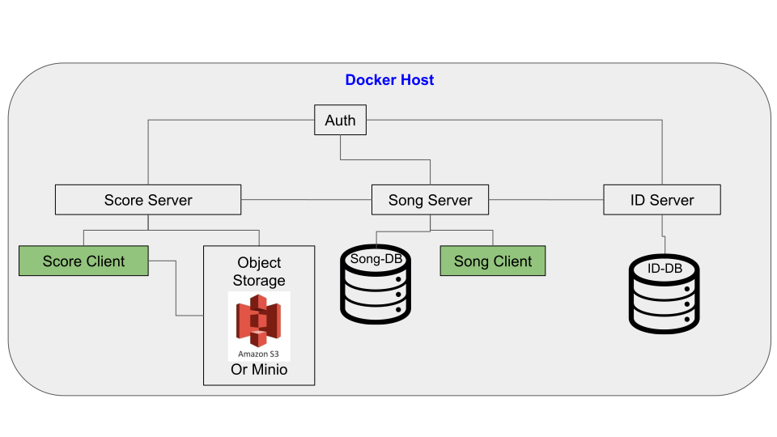

.. _docker_for_song_ref:

=============================
Docker for SONG
=============================
..
    .. image:: ../../song-docker/song-logo.gif
       :align:  center
       :scale: 60%

Introduction
========================

.. warning::

    Docker for SONG is meant to **demonstrate** the configuration and usage of `SONG <https://github.com/overture-stack/SONG>`_, and is **NOT INTENDED FOR PRODUCTION**. If you decide to ignore this warning and use this in any public or production environment, please remember to change the passwords, accessKeys, and secretKeys. 

What is Docker for SONG?
---------------------------

Important Features
--------------------------

* Turn-key bring up of SONG, SCORE, dcc-id and the dcc-auth services
  
* Completely configurable via docker-compose environment variables (i.e change ports, jmx ports, hosts, credentials, and other important data fields). Values are injected into configurations using a custom python script
  
* Data from databases (``song-db`` and ``id-db``) and auth service are saved in volumes.
  
* Logs from the ``song-server``, ``score-server`` and ``dcc-id-server`` are mounted to the docker host for easy viewing via the ``./logs`` directory
  
* SCORE and SONG clients are automatically downloaded, configured and mounted to the docker host via the ``./data`` directory

* Minio (s3 object storage) data is also mounted via the ``./data`` directory. Files can be uploaded by simply copying into ``./data/minio``

* Uses ``base-ubuntu`` and ``base-db`` images to minimize pulling and building of docker images, and maximize reuse

* If you decide to go to production, the databases from the volumes can be easily dumped, and the data from minio can be uploaded directly

Bonus Features
^^^^^^^^^^^^^^^^^^
The `Minio <https://www.minio.io>`_ and `OAuth2 <https://django-oauth-toolkit.readthedocs.io/en/latest>`_ services can be managed using their UIs\!

1. `Minio <https://www.minio.io/>`_ UI
    * Url: `<http://localhost:8085>`_
    * AccessKey: `minio`
    * SecretKey: `minio123`

2. `OAuth2 <https://django-oauth-toolkit.readthedocs.io/en/latest>`_ UI
    * Adapted from the wonderful `dandric/simpleauth <https://github.com/andricDu/SimpleAuth>`_ docker container
    * Url: `<http://localhost:8084/admin>`_
    * Username: `john.doe`
    * Password: `songpassword`

.. _docker_microservice_architecture:

Microservice Architecture
---------------------------
* Each box represents a docker container, and the lines connecting them indicate a TCP/IP connection.
* Each Postgres database is its own docker container.
* ``storage-client`` and ``song-client`` are command line tools and used locally. They are used to communicate with the ``storage-server`` and ``song-server``, respectively

.. todo::
    In the image, replace "DCC-Storage Server" with "SCORE Server"

Prerequisites
================

Mandatory
----------------

* `Docker <https://docs.docker.com/install/linux/docker-ce/ubuntu/>`_ version 17.09.0-ce or higher
* Linux docker host machine (cannot run on **Docker for Mac** or **Docker for Windows**)
* `Docker-compose <https://docs.docker.com/compose/install/#install-compose>`_ version 1.16.1 and up
* Ports 8080 to 8089 on localhost are unused

Optional
-------------
* `jq <https://stedolan.github.io/jq/>`_ for json formatting and grepping (install via `apt install jq`)

Getting Docker for SONG
=========================
In order to run the Docker for SONG, the latest release must be downloaded. Before downloading, the latest release tag must be found.

Find the Latest Official Release Tag
-------------------------------------

To find the latest official release tag, refer to :ref:`server_official_releases`. Instead of using the ``song-`` prefex for the regex, replace it with ``^song-docker-\\d+\\.\\d+\\.\\d+$``. For example ``song-docker-1.0.0``.

Download
---------------
Using the desired release tag, the docker repository can be downloaded via:

Download ZIP
^^^^^^^^^^^^^^^^^^^^^

.. code-block:: bash

    curl -Ls 'https://github.com/overture-stack/SONG/archive/$RELEASE_TAG.zip' -o $RELEASE_TAG.zip
    

Download TAR.GZ
^^^^^^^^^^^^^^^^^^^^^

.. code-block:: bash

    curl -Ls 'https://github.com/overture-stack/SONG/archive/$RELEASE_TAG.tar.gz' -o $RELEASE_TAG.tar.gz

Download using GIT
^^^^^^^^^^^^^^^^^^^^^

.. code-block:: bash

    git clone --branch $RELEASE_TAG https://github.com/overture-stack/SONG.git $RELEASE_TAG

Build and Run
===============
From the ``song-docker`` directory, run:

.. code-block:: bash

    docker-compose build
    docker-compose up

.. note:: 
    An internet connection is only needed for the ``docker-compose build`` command. No external services are required for the ``docker-compose up`` command.

Configuration
======================
* All contained within the `docker-compose.yml <https://github.com/overture-stack/SONG/blob/develop/song-docker/docker-compose.yml>`_

* If a port is occupied on the localhost, it can be reconfigured by changing the value of the environment variable defining it (i.e SERVER_PORT, PGPORT, ID_PORT ... etc)

* Default song-docker credentials and information are stored in the  `credentials.txt <https://github.com/overture-stack/SONG/blob/develop/song-docker/credentials.txt>`_ file.

.. _docker_tutorial_ref:

Tutorial
==============
The following tutorial executes the complete :ref:`data submission workflow <intro_data_sub_workflow_ref>` in 
4 stages using the Java CLI Client which is automatically configured in the ``song-docker/data/client`` directory. 
This tutorial assumes current working directory is the ``song-docker`` directory.

.. todo: once CLI documentation is complete, use this:
    :ref:`Java CLI Client <java_cli_ref>` 

.. note::
    Although this tutorial uses the ``icgc-storage-client``, it is in the process of being renamed to the ``score-client``

Stage 1:  SONG Upload
-----------------------

1. Check that the SONG server is running
    
.. code-block:: bash

    ./data/client/bin/sing status -p

2. Upload the example VariantCall payload, which contains the metadata. The response will contain the ``uploadId``

.. code-block:: bash

    ./data/client/bin/sing upload -f  ./example/exampleVariantCall.json

3. Check the status of the upload, using the `uploadId``. Ensure the response has the state ``VALIDATED``

.. code-block:: bash

    ./data/client/bin/sing status -u <uploadId>

4. Record or remember the ``uploadId`` from the response for the next phase

Stage 2: SONG Saving and Manifest Generation
--------------------------------------------------

1. Save or commit the finalized metadata. The response will contain the ``analysisId``

.. code-block:: bash

    ./data/client/bin/sing save -u <uploadId>

2. Search for the saved analysis, and observe the field ``analysisState`` is set to ``UNPUBLISHED``

.. code-block:: bash

    ./data/client/bin/sing search -a <analysisId>

3. Optionally, if you have ``jq`` installed, you can pipe the output of the search, and filter out the ``analysisState`` field

.. code-block:: bash

    ./data/client/bin/sing search -a <analysisId>    |  jq ‘.analysisState’

4. Generate a manifest for the ``icgc-storage-client`` in :ref:`Stage 3 <stage_3_ref>`

.. code-block:: bash

    sudo ./data/client/bin/sing manifest -a <analysisId> -f manifest.txt

.. _stage_3_ref:

Stage 3: SCORE Upload
-------------------------------------
Upload the manifest file to the ``score-server`` (formally the ``icgc-dcc-storage`` server) using the `icgc-storage-client <http://docs.icgc.org/software/binaries/#storage-client>`_. This will upload the files specified in the `exampleVariantCall.json <https://github.com/overture-stack/SONG/blob/develop/song-docker/example/exampleVariantCall.json>`_ payload, which are located in the ``./example`` directory

.. code-block:: bash

    ./data/storage-client/bin/icgc-storage-client upload --manifest manifest.txt

Stage 4: SONG Publish
------------------------

1. Using the same ``analysisId`` as before, publish it. Essentially, this is the handshake between the metadata stored in the SONG server (via the analysisIds) and the files stored in the ``score-server`` (the files described by the ``analysisId``)

.. code-block:: bash

    ./data/client/bin/sing publish -a <analysisId>

2. Search the ``analysisId``, pipe it to jq and filter for ``analysisState``, and observe the analysis has finally been **published** \!\!\!

.. code-block:: bash

    ./data/client/bin/sing search -a <analysisId>    |  jq ‘.analysisState’

Issues
=============
If you encounter any issues, please report them `here <https://github.com/overture-stack/SONG/issues>`_

License
=============
Copyright (c) 2018. Ontario Institute for Cancer Research

This program is free software: you can redistribute it and/or modify
it under the terms of the GNU Affero General Public License as
published by the Free Software Foundation, either version 3 of the
License, or (at your option) any later version.

This program is distributed in the hope that it will be useful,
but WITHOUT ANY WARRANTY; without even the implied warranty of
MERCHANTABILITY or FITNESS FOR A PARTICULAR PURPOSE.  See the
GNU Affero General Public License for more details.

You should have received a copy of the GNU Affero General Public License
along with this program.  If not, see <https://www.gnu.org/licenses/>.
