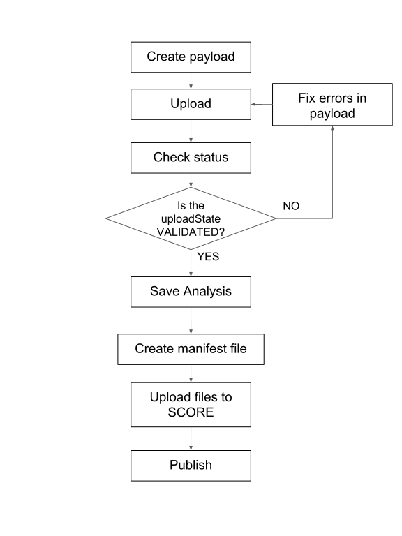
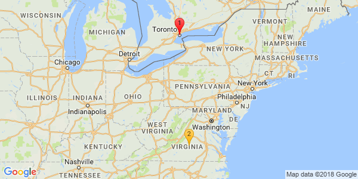

==============
Introduction
==============

What is SONG?
======================

`SONG <https://www.overture.bio/products/song>`_ is a robust metadata and validation system used to quickly and reliably track genome metadata scattered across multiple cloud storage systems. 
In the field of genomics and bioinformatics, metadata managed by simple solutions such as spreadsheets and text files require significant time and effort to maintain and ensure the data is reliable. 
With several users and thousands of genomic files, tracking the state of metadata and their associations can become a nightmare. 
The purpose of SONG is to minimize human intervention by imposing rules and structure to user uploads, which as a result produces high quality and reliable metadata with a minimal amount of effort. 
SONG is one of many products provided by the `Overture-Stack <https://overture.bio>`_ and is completely open-source and free for everyone to use.

.. seealso::
    
    For additional information on other products in the Overture stack, please visit https://overture.bio

.. sidebar:: Did you know?

    Did you know that **SONG** is actually a recurrsive acronym for
    **S**\ ONG's **O**\ ur **N**\ ew **G**\ NOS? 
    
    GNOS (Genomic Network Operating System) was a genomic data repository built and maintained by Annai Systems, which ceased operation in 2017. In response to the vacant position for a genomic metadata system, **SONG** was born.
    

.. 
    What SONG is NOT
    ==================

-----------------------------------------

.. _introduction_features:

Features
======================

- Synchronous and asynchronous metadata validation using `JsonSchema <http://json-schema.org>`_
- Strictly enforced data relationships and fields
- Optional schema-less JSON info fields for user specific metadata
- Standard REST API that is easy to understand and work with
- Simple and fast metadata searching
- Export payloads for SONG mirroring
- Clear and concise error handling
- ACL security using OAuth2 and scopes based on study codes
- Unifies metadata with object data stored in SCORE
- Built-in `Swagger UI <https://song.cancercollaboratory.org/swagger-ui.html>`_ for API interaction

.. _intro_data_sub_workflow_ref:

Data Submission Workflow
======================================

The data submission workflow can be separated into 4 main stages:

1. Metadata Upload (SONG)
2. Metadata Saving (SONG)
3. Object data Upload (SCORE)
4. Publishing Metadata (SONG)

The following diagram summarized the steps involved in successful data submission using SONG and SCORE:

.. _intro_projects_user_song_ref:

Projects Using SONG
======================

.. generated at https://staticmapmaker.com/google/

.. .. image:: https://maps.googleapis.com/maps/api/staticmap?autoscale=false&size=600x300&maptype=roadmap&format=png&visual_refresh=true&markers=size:mid%7Ccolor:0xff0000%7Clabel:1%7CToronto&markers=size:mid%7Ccolor:0xffb100%7Clabel:2%7CVirginia&markers=size:mid%7Ccolor:0x0a00ff%7Clabel:3%7CBerlin&markers=size:mid%7Ccolor:0x00d70b%7Clabel:4%7CHeidelberg

.. .. image:: https://maps.googleapis.com/maps/api/staticmap?autoscale=false&size=600x300&maptype=roadmap&format=png&visual_refresh=true&markers=size:mid%7Ccolor:0xff0000%7Clabel:1%7CToronto&markers=size:mid%7Ccolor:0xffb100%7Clabel:2%7CVirginia

.. .. image:: https://maps.googleapis.com/maps/api/staticmap?autoscale=2&size=600x300&maptype=roadmap&format=png&visual_refresh=true&markers=size:mid%7Ccolor:0xff0000%7Clabel:2%7CAWS+Virginia&markers=size:mid%7Ccolor:0xff0000%7Clabel:1%7CCancer+Collaboratory+Toronto

**Legend**:

.. raw:: html

    <ul style="list-style-type:none" >
        <li>
            <strong>
                
                    Cancer Collaboratory - Toronto
                
            </strong>: <a href="https://song.cancercollaboratory.org">song.cancercollaboratory.org</a>
        </li>
        <li>
            <strong>
                
                    AWS - Virginia
                
            </strong>: <a href="https://virginia.song.icgc.org">virginia.song.icgc.org</a>
        </li>
        <!-- Only add back in when both servers are live
        <li>
            <strong>
                
                    DKFZ - Berlin
                
            </strong> 
        </li>
        <li>
            <strong>
                
                    DKFZ - Heidelberg
                
            </strong>
        </li>
        -->
    </ul>

Getting Started
============================

The easiest way to understand SONG, is to simply use it! 
Below is a short list of different ways to get started on interacting with SONG.

Tutorial using a CLI with Docker for SONG
----------------------------------------------------
The :ref:`Docker for SONG tutorial <docker_tutorial_ref>` is a great way to spin-up SONG and all its dependent services using Docker on your host machine. Use this if you want to play with SONG locally. 
Refer to the :ref:`Docker for SONG <docker_for_song_ref>` documentation.

Tutorial using the Python SDK with SONG
-------------------------------------------
The :ref:`SONG Python SDK Tutorial <sdk_python_tutorial_ref>` is a Python client module that is used to interact with a running SONG server. Use it with one of the :ref:`Projects Using SONG <_intro_projects_using_song_ref>`, or in combination with :ref:`Docker for SONG <docker_for_song_ref>`. For more information to about the Python SDK, refer to the :ref:`SONG Python SDK <song_python_sdk_ref>` documentation.

Play with a CLI
--------------------------
If you want to play with SONG from your terminal, there are few :ref:`Command Line Client <command_line_clients_ref>` tutorials to choose from, such as the :ref:`Java CLI Tutorial <java_cli_tutorial_ref>` or the :ref:`GO CLI Tutorial <go_cli_tutorial_ref>` .

Play with the REST API from your browser
--------------------------------------------
If you want to play with SONG from your browser, simply visit the Swagger UI for each server:

1. **Cancer Collaboratory - Toronto**: https://song.cancercollaboratory.org/swagger-ui.html
2. **AWS - Virginia**: https://virginia.song.icgc.org/swagger-ui.html

.. seealso::
    For more information about user access, refer to the :ref:`User Access <user_access_ref>` documentation.

Deploy SONG to Production
------------------------------
If you want to deploy SONG onto a server, refer to the :ref:`Deploying a SONG Server in Production <server_ref>` documentation.

.. todo::

    - join our gitter channel!

License
=============
Copyright (c) 2018. Ontario Institute for Cancer Research

This program is free software: you can redistribute it and/or modify
it under the terms of the GNU Affero General Public License as
published by the Free Software Foundation, either version 3 of the
License, or (at your option) any later version.

This program is distributed in the hope that it will be useful,
but WITHOUT ANY WARRANTY; without even the implied warranty of
MERCHANTABILITY or FITNESS FOR A PARTICULAR PURPOSE.  See the
GNU Affero General Public License for more details.

You should have received a copy of the GNU Affero General Public License
along with this program.  If not, see <https://www.gnu.org/licenses/>.
